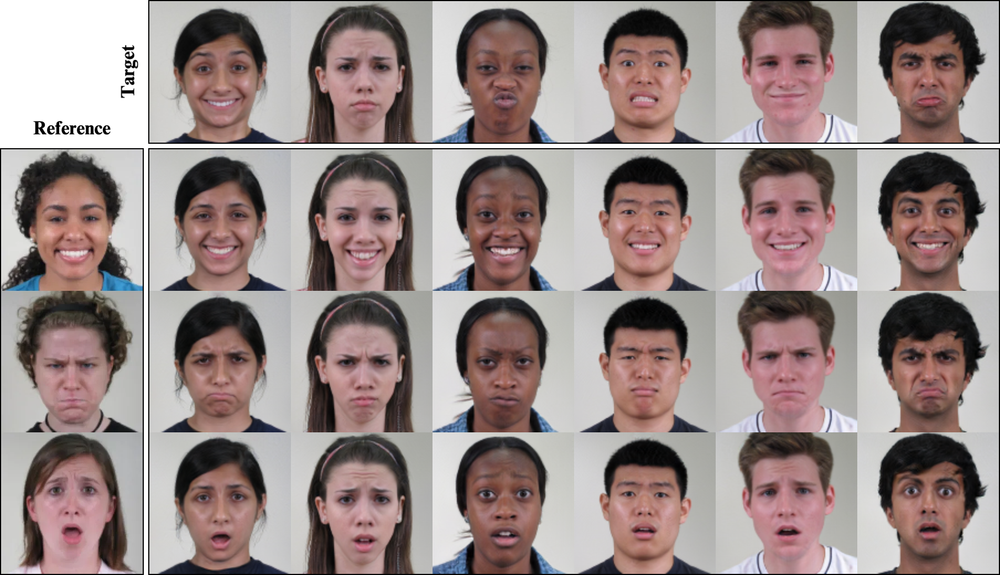
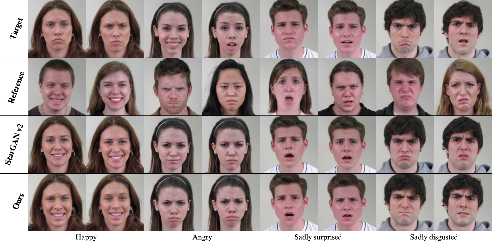
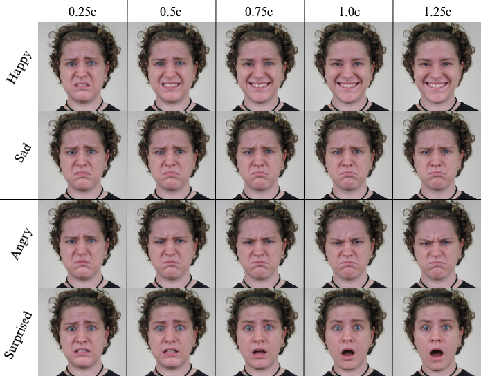

## 2CET-GAN &mdash; Official PyTorch Implementation
  
[](https://creativecommons.org/licenses/by-nc/4.0/)

2 cycles expression transfer GAN (2CET-GAN) is a Pixel to Pixel Human Facial Expression Transfer GAN.
This is a pytorch implementation.
<p ></p>

## Demo
Compare with StarGAN v2:
<p ></p>
<br>
Continuity: 
<p ></p>

## Structure
<p ></p>
2 cycles design of 2CET-GAN.

## Datasets
You can apply the access of **CFEE** at: http://cbcsl.ece.ohio-state.edu/dbform_compound.html
<br>
You can find the code to preprocess the dataset under dir `dataset/`

## Training
Please define `$DATASET_ROOT` and `$OUTPUT_ROOT` before the command:
```bash
python main.py \
--mode train \
--resume_iter 0 \
--img_size 128 \
--code_dim 32 \
--encoder_grey True \
--lr_e 0.0001 \
--lambda_reg 0.5 \
--lambda_c_e_config 5000,30000,1.0,1.0 \
--lambda_ds_e_config 0,100000,1.0,0.0 \
--train_dir ${DATASET_ROOT}/train \
--test_dir ${DATASET_ROOT}/test \
--batch_size 8 \
--output_dir ${OUTPUT_ROOT}/output \
--models_dir ${OUTPUT_ROOT}/models \
--output_every 500 \
--save_every 5000 \
--total_iter 100000

```

## Evaluation
Please set `--eval_model_step` and `--eval_dir` in the command:
```bash
python main.py \
--mode eval \
--eval_dir /content/eval \
--eval_model_step 65000 \
--img_size 128 \
--code_dim 32 \
--encoder_grey True \
--train_dir ${DATASET_ROOT}/train \
--test_dir ${DATASET_ROOT}/test \
--batch_size 8 \
--output_dir ${OUTPUT_ROOT}/output \
--models_dir ${OUTPUT_ROOT}/models \

```

##  Pretrained model
